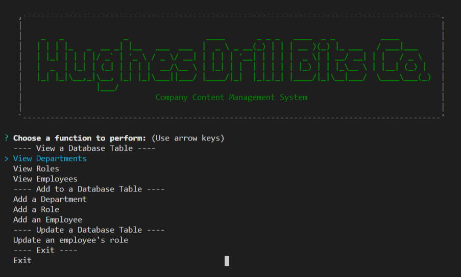

# Employee Tracker

## Description

A content management system written in node.js connected to a mysql database. Functions include ability to display and add departments, roles, and employess, and modify an employee's role.

## Table of Contents

- [Installation](#installation)
- [Usage](#usage)
- [Contributing](#contributing)
- [Tests](#tests)
- [License](#license)
- [Questions](#questions)
- [Screenshot](#screenshot)
- [Links](#links)

## Installation

Clone and then "npm i"

## Usage

Execute "node server-cms.js"

## Contributing

None

## Tests

None

## License

The_Unlicense

For information on this license, please follow [this link](https://choosealicense.com/licenses/unlicense/)

## Questions

Contact the author with questions via GitHub or email at

[JonPointer at GitHub](https://github.com/JonPointer) jonpointer@msn.com

## Screenshot

## Links

[GitHub Repo](https://github.com/JonPointer/employee-tracker)  
[Sample Video Recording](https://drive.google.com/file/d/1QnCgpyY7-yW90D2zIGWxS6nnE2WFEylY/view)
